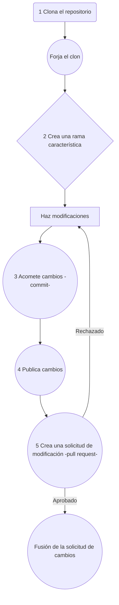

<!-- PROJECT SHIELDS -->
<!--
*** I'm using markdown "reference style" links for readability.
*** Reference links are enclosed in brackets [ ] instead of parentheses ( ).
*** See the bottom of this document for the declaration of the reference variables
*** for contributors-url, forks-url, etc. This is an optional, concise syntax you may use.
*** https://www.markdownguide.org/basic-syntax/#reference-style-links
-->

<!-- Aquí iran insignias de github, que serán habilitadas cuando el proyecto esté en público -->

[![Contributors][contributors-shield]][contributors-url]
[![Forks][forks-shield]][forks-url]
[![Stargazers][stars-shield]][stars-url]
[![Issues][issues-shield]][issues-url]


<!-- PROJECT LOGO -->
<br />
<div align="center">


  
    

</div>


<!-- ABOUT THE PROJECT -->
# El proyecto


Es una plataforma web diseñada para mejorar tu productividad y bienestar mediante la gestión eficiente de tus sesiones de trabajo y descansos. Basada en técnicas de productividad comprobadas, esta herramienta te ayuda a mantener un equilibrio saludable entre enfoque y recuperación, optimizando tus ciclos de concentración.


### Herramientas de construcción

* Diseño UX/UI:
   * 
   *  [Ideas](https://www.figma.com/board/6xpeDZMxKlPqm7xTPzZbfl/Break-and-focus?node-id=1-2&node-type=section&t=SYtaJRCHHtf3fuMa-0)
   *  [Prototipo](https://www.figma.com/design/oc2sSuVpy9hgPNTmeg9nlP/Break-and-Focus?node-id=0-1&node-type=canvas&t=rbLVrRumr9ICiAVS-0)


* Backend: 
   * [![NodeJS][NodeJS]][Node-url] [![Express.js][Express.js]][Express-url]
   * [![TypeScript][TypeScript]][TypeScript-url] [![Mongoose][Mongoose]][Mongoose-url] 
   * [![MongoDB][MongoDB]][MongoDB-url] [![Passport][Passport]][Passport-url] [![Zod][Zod]][Zod-url]
   * [Deploy]( )

* Frontend: 
   * [![Next.js][Next.js]][Next-url]
   * [![React.js][React.js]][React-url]
   * [![Zustand][Zustand]][Zustand-url]
   * [![Axios][Axios]][Axios-url]
   * [![TailwindCSS][TailwindCSS]][TailwindCSS-url]
     
 


<!-- GETTING STARTED -->
## Inicio

A continuación las instrucciones para correr el proyecto de forma local.

### Prerequisitos

* En la línea de comandos revisar si tienes instalado NodeJs
  ```sh
  node -v
  ```
Si no está instalado, [descargarlo](https://nodejs.org/en) e instalarlo.

### Instalación

1. Clona el repositorio
   ```sh
   git clone git@github.com:No-Country-simulation/s18-09-m-node-react.git
   ```
1. Abre el directorio del proyecto Frontend o Backend
   ```sh
   cd directorio
   ```
   
3. Instalar los paquetes desde NPM
   ```sh
   npm install
   ```
4. Correr el proyecto en modo de desarrollo
   ```js
   npm run dev
   ```


<!-- ROADMAP -->
## Características

1. Crear sesiones de trabajo personalizadas ajustadas a tus necesidades.

2. Seguir técnicas de descanso como Pomodoro u otras técnicas flexibles.

3. Monitorear tu rendimiento con métricas detalladas de tiempo de foco, descanso y efectividad.

4. Ideal para profesionales, estudiantes o cualquier persona que busque mejorar su enfoque y rendimiento diario, Break & Focus te permite maximizar tu productividad sin descuidar tu bienestar.
    

Vea las [incidencias abiertas (issues)](https://github.com/No-Country-simulation/s18-09-m-node-react/issues) para una lista completa de las características (e incidencias conocidas).


<!-- CONTRIBUTING -->
## Contribuciones

Las contribuciones son las que hacen de la comunidad de código abierto un maravilloso lugar para aprender, inspirarse y crear. Cualquier contribución sera **grándemente apreciada**.

Si tiene una sugerencia que haga mejorar este proyecto, por favor haga un fork del repositorio y envíe una solicitud de modificación (pullrequest). También puede abrir una incidencias (issue) con la etiqueta "enhancement".

Favor no olvidar reconocer el proyecto con una estrella. 

Pasos para hacer contribuciones al proyecto:

1. Haga un Fork del proyecto
2. Crea tu rama con el nombre de la característica (`git checkout -b característica/CaracterísticaAsombrosa`)
3. Acomete tus cambios (`git commit -m 'Add some CaracterísticaAsombrosa'`)
4. Publica tu rama (`git push origin feature/AmazingFeature`)
5. Abre una solicitud de modificación (pull request)




<!-- ACKNOWLEDGMENTS -->
## Reconocimientos

Queremos dar un reconocimiento especial a estas organizaciones por el impulso para lanzar este proyecto:

* [No Country](https://www.nocountry.tech/)

<!-- MARKDOWN LINKS & IMAGES -->
<!-- https://www.markdownguide.org/basic-syntax/#reference-style-links -->
[contributors-shield]: https://img.shields.io/github/contributors/No-Country-simulation/s18-09-m-node-react.svg?style=for-the-badge
[contributors-url]: https://github.com/No-Country-simulation/s18-09-m-node-react/graphs/contributors
[forks-shield]: https://img.shields.io/github/forks/No-Country-simulation/s18-09-m-node-react.svg?style=for-the-badge
[forks-url]: https://github.com/No-Country-simulation/s18-09-m-node-react/switchmodes/network/members
[stars-shield]: https://img.shields.io/github/stars/No-Country-simulation/s18-09-m-node-react.svg?style=for-the-badge
[stars-url]: https://github.com/No-Country-simulation/s18-09-m-node-react/stargazers
[issues-shield]: https://img.shields.io/github/issues/No-Country-simulation/s18-09-m-node-react.svg?style=for-the-badge
[issues-url]: https://github.com/No-Country-simulation/s18-09-m-node-react/issues

[Next.js]: https://img.shields.io/badge/next.js-000000?style=for-the-badge&logo=nextdotjs&logoColor=white
[Next-url]: https://nextjs.org/
[Vitejs]: https://img.shields.io/badge/vite-%23646CFF.svg?style=for-the-badge&logo=vite&logoColor=white
[NodeJS]: https://img.shields.io/badge/Node.js-43853D?style=for-the-badge&logo=node.js&logoColor=white
[Node-url]: https://nodejs.org/
[Express.js]: https://img.shields.io/badge/Express.js-404D59?style=for-the-badge
[Express-url]: https://expressjs.com/
[TypeScript]: https://img.shields.io/badge/TypeScript-007ACC?style=for-the-badge&logo=typescript&logoColor=white
[TypeScript-url]: https://www.typescriptlang.org/
[Mongoose]: https://img.shields.io/badge/Mongoose-880000?style=for-the-badge&logo=MongoDB&logoColor=white
[Mongoose-url]: https://mongoosejs.com/
[MongoDB]: https://img.shields.io/badge/MongoDB-47A248?style=for-the-badge&logo=mongodb&logoColor=white
[MongoDB-url]: https://www.mongodb.com/
[Passport]: https://img.shields.io/badge/Passport-34E27A?style=for-the-badge&logo=passport&logoColor=white
[Passport-url]: https://www.passportjs.org/
[Zod]: https://img.shields.io/badge/Zod-5B8DBD?style=for-the-badge
[Zod-url]: https://zod.dev/
[Next.js]: https://img.shields.io/badge/Next.js-000000?style=for-the-badge&logo=nextdotjs&logoColor=white
[Next-url]: https://nextjs.org/
[React.js]: https://img.shields.io/badge/React-20232A?style=for-the-badge&logo=react&logoColor=61DAFB
[React-url]: https://reactjs.org/
[Zustand]: https://img.shields.io/badge/Zustand-005570?style=for-the-badge&logo=zustand&logoColor=white
[Zustand-url]: https://zustand-demo.pmnd.rs/
[Axios]: https://img.shields.io/badge/Axios-5A29E4?style=for-the-badge&logo=axios&logoColor=white
[Axios-url]: https://axios-http.com/
[TailwindCSS]: https://img.shields.io/badge/TailwindCSS-38B2AC?style=for-the-badge&logo=tailwind-css&logoColor=white
[TailwindCSS-url]: https://tailwindcss.com/
